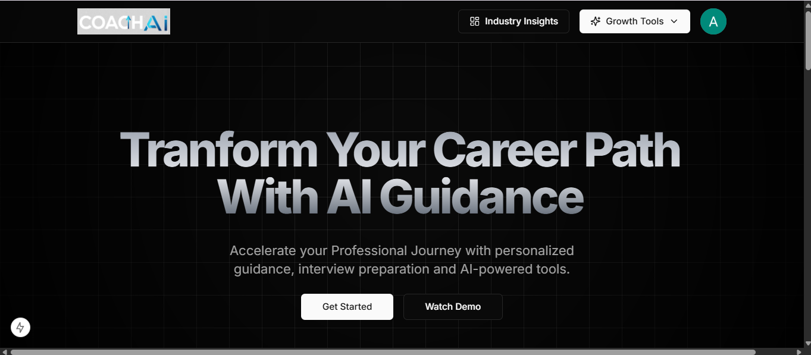
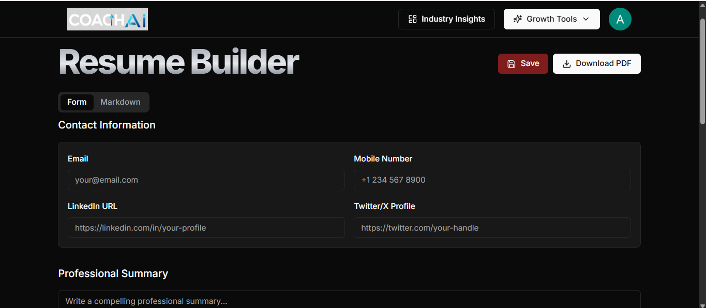
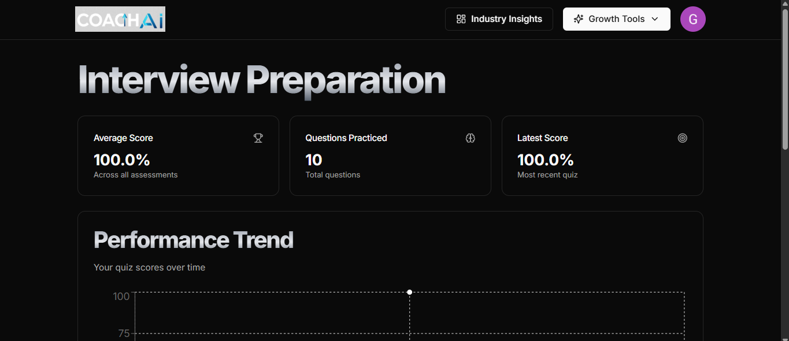
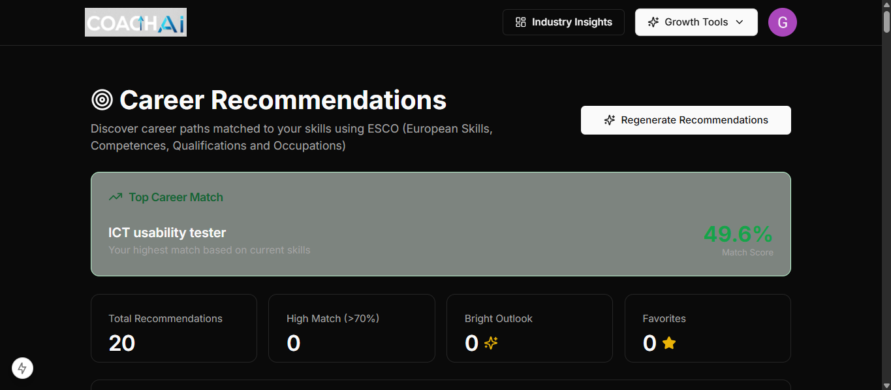

# AI Career Coach 🚀

Welcome to AI Career Coach, an AI-powered full-stack platform designed to help students and job seekers improve their career growth through intelligent resume analysis, mock interviews, and personalized career guidance.

👩‍💻 Developer: Akshaya Gajawada

I developed this project to simplify career preparation using AI-driven insights and modern web technologies. The platform helps users analyze resumes, identify skill gaps, prepare for interviews, and receive personalized career recommendations.


AI-powered career guidance platform built using Next.js, Prisma, Tailwind CSS, and Gemini AI.

## Features

- AI Resume Builder
- ATS Resume Analysis
- Mock Interviews
- Personalized Career Guidance
- Skill Gap Analysis
- Industry Insights Dashboard
- AI-powered Recommendations

## Tech Stack

- Next.js
- React.js
- Tailwind CSS
- Prisma
- PostgreSQL
- Gemini AI
- Clerk Authentication

## Screenshots

### Dashboard


### Resume Builder


### Mock Interview


### Job recommendations


## Installation

```bash
git clone https://github.com/akshayagajawada/AI-CAREER-COACH.git

cd AI-CAREER-COACH

npm install

npm run dev
```

## Author

Akshaya Gajawada
